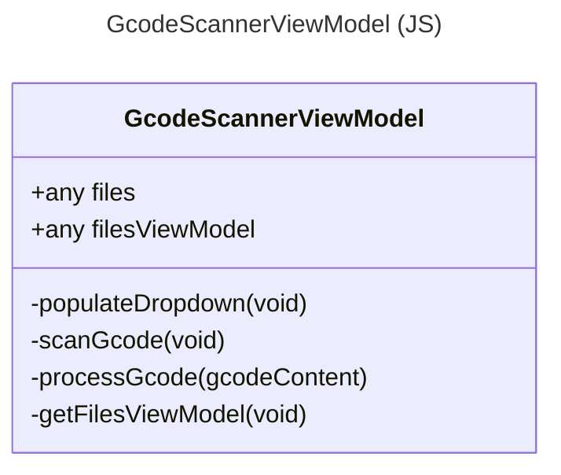
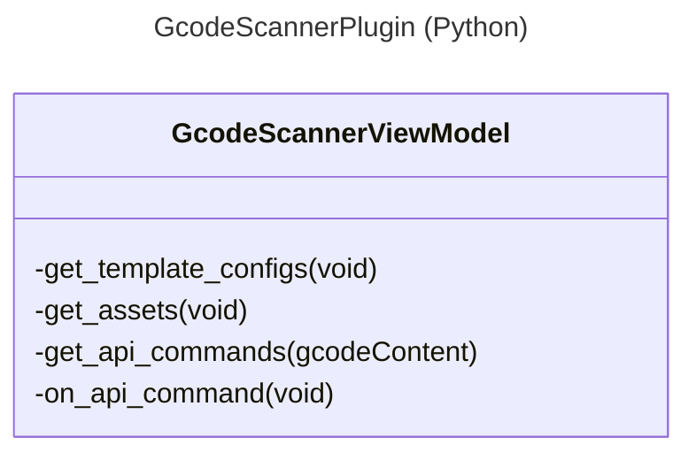

# Class Diagram

```mermaid
---
title: GcodeScannerViewModel (JS)
---
classDiagram
    class GcodeScannerViewModel
    GcodeScannerViewModel : +any files
    GcodeScannerViewModel : +any filesViewModel
    GcodeScannerViewModel : -populateDropdown(void)
    GcodeScannerViewModel : -scanGcode(void)
    GcodeScannerViewModel : -processGcode(gcodeContent)
    GcodeScannerViewModel : -getFilesViewModel(void)
```

```mermaid
---
title: GcodeScannerPlugin (Python)
---
classDiagram
    class GcodeScannerViewModel
    GcodeScannerViewModel : -get_template_configs(void)
    GcodeScannerViewModel : -get_assets(void)
    GcodeScannerViewModel : -get_api_commands(gcodeContent)
    GcodeScannerViewModel : -on_api_command(void)
```
