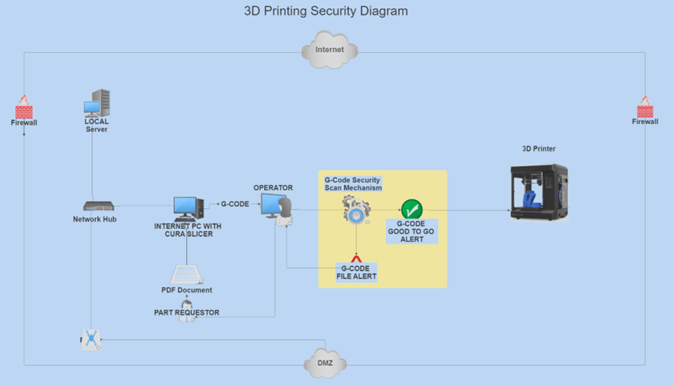

****

**Design Document**

**CIS 4398 Section 001**

**Sprint 2025**

**Introduction** 

This document describes the software application architecture
and how all the requirements are mapped into a design for the G-Code Pre-Print Auditing System.
It provides detailed insight into the design by combining different diagrams, textual descriptions,
and detailing system components using pictures and programming if required.
The document entails mockups, wireframes, or hardware architecture diagrams as well as system block diagrams as needed.

Octo Print Overview
OctoPrint allows you to control every facet of the 3D printer and its capabilities. That is achieved by connecting to the application with your browser. However, we aim to use the OctoPrint API to control print jobs and monitor printing via the backend application running on some hardware on the network. The front-end app will not connect directly to OctoPrint however the client can be given privileges to connect to the OctoPrint Web services and monitor printing. The client will be interacting with the front-end app for sending print jobs.

**Requirements / Features**

The system consists of different components

•	This application design requires a network to fully function properly.

•	The application requires very low Ram and CPU overhead therefore it will be able to run on any modern system of choice.

•	Networking paradigm: Seamless communication between components.

•	Frontend Application: GUI-based interface for monitoring warnings before printing.

•	Backend Application: For handling G-Code Scanning and warning the client to take precautions before printing.

•	Database: This application will not require a database. However, it will provide a success / failure report the client.

•	3D-Printer Interface: A hardware running both client and or backend code for interacting with printers.

•	Other features can be included in future enhancements such as multiple printer or multiple print job handling.

**System Architecture / Logical Structure**

Diagram A

**Component Description**

•	Backend G-Code Parser Pre-Print Scanner

•	Frontend User Interface

•	All devices are networking

•	Diagram A shows a risk introduction

•	The exclamation mark is a response action from the backend scanning application

•	The red X shows that a file was damaged or compromised

•	Inside the scanner diagram we can see the backend application communicating with OctoPrint

**Diagram A:**
Depicts the risk introduced to a file and how the backend application picks up the mistake
and rejects the G-Code alerting the user to stop printing and supply a new or correct document.

**Component Overview**

•	The diagram shows a logical process of client and hardware interaction as well as a third-party risk shown to demonstrate how the application will block the print to avoid downtime or damage.

•	Please see the high-level view of the components in the diagram above.
We can see
that there are two major software components which make up the G-Code Pre-Print Scanning design. The frontend and the backend apps are
running seamlessly on the network without any use of external USB drives.

•	Data flow on the network shows that the print job is sent via the frontend app to the printer and the app will direct the file to the backend app for a complete security scan. Once the data has been approved and safe an alert will be sent to the client giving them the opportunity to print or stop.

**Interface and APIs in Diagram A**

**OctoPrint API Integration:** 

As we delve into the low-level view of the OctoPrint, we will examine the features provided by the REST API services.
REST API General information is obtained by visiting their website. There is a wealth of information available as well as plugins to handle API keys so that clients can implement their own solution.

https://docs.octoprint.org/en/master/api/general.html

This document will not go into details of any code unless deemed necessary for some unclear workflows.

**File Handling and Processing**

•	Files are received as PDF documents containing the part.
A Cura slicer on the computer will slice the part and convert it to G-CODE for printing.
The file is then opened in the frontend app and sent for printing.
The frontend app sends it directly to the backend app and it is scanned for integrity.
The backend app will alert the user with a status of pass or fail alert.
The user will take action based on the result of the scan.

•	3D Printer Interfacing
•	User Interface

**REVISITING THE 3D-PRINTING BLOCK DIAGRAM**

DIAGRAM B

DiagramB: This diagram gives a high-level view of the application components in a typical network environment. There are no portable usb drives used in this scenario since it could be a military or Government environment.

**Proposed Application Design**

The application will consist of two parts.
There will be a frontend application, for example,
a web-based gui and then a backend application running on the network watching for print jobs from the front end.
The front end GUI application will consist of Java scripting and web components, 
and the backend application will be completed in Python.
As of this writing,
we were proposing the use of a Raspberry Pie
for running the backend operations with OctoPrint services installed on that device.
If there is a plan to not use the Raspberry Pi we can simply use any computer on the network for our modular application
to reside and execute printing tasks.  

describes the software architecture and how the requirements are mapped into the design. This document will be a combination of diagrams and text that describes what the diagrams are showing.

**Requirements**

In addition to the general requirements the Design Document - Part I Architecture will contain:

A description the different components and their interfaces. For example: client, server, database.

For each component provide class diagrams showing the classes to be developed (or used) and their relationship.

Sequence diagrams showing the data flow for _all_ use cases. One sequence diagram corresponds to one use case and different use cases should have different corresponding sequence diagrams.

Describe algorithms employed in your project, e.g. neural network paradigm, training and training data set, etc.

If there is a database:

Entity-relation diagram.

Table design.

A check list for architecture design is attached here [architecture\_design\_checklist.pdf](https://templeu.instructure.com/courses/106563/files/16928870/download?wrap=1 "architecture_design_checklist.pdf")  and should be used as a guidance.

