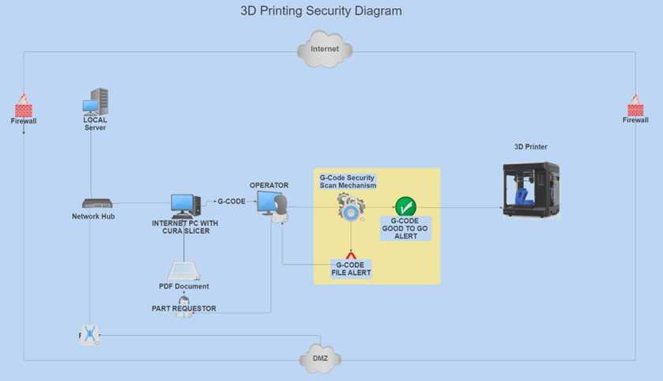

# File Handling and Processing

- Files are received as **PDF documents** containing the part.
- A **Cura slicer** on the computer slices the part and converts it to **G-Code** for printing.
- The file is then **opened in the frontend application** and sent for printing.
- The **frontend application** sends it directly to the **backend application**, where it is scanned for integrity.
- The **backend application** alerts the user with a **pass or fail status**.
- The user takes action based on the result of the scan.

## 🖨️ 3D Printer Interfacing
- The application ensures **seamless integration** with networked 3D printers.
- No **portable USB drives** are used, ensuring compliance with **military or government security policies**.

## 🎛️ User Interface
- The **frontend application** serves as the **primary interaction point** for users.
- It provides **real-time alerts, file management, and print job monitoring**.

---

# 🔄 Revisiting the 3D-Printing Block Diagram

  
**Diagram B**

Diagram B presents a **high-level view** of the application components in a **typical network environment**.  
**USB drives are not used** in this scenario due to **security considerations** in **military or government environments**.

---

## 🏗️ Component Description

- **🔥Firewall** – Basic standard dual firewall configuration.
- **🛠️ G-Code Security Scan Mechanism** – Backend application processes and verifies the G-Code before printing.
- **💻 G-Code GUI Frontend** – Frontend application takes g-code and sends the G-Code for pre-print evaluation.
- **⚠️ G-Code Scan warning or alter** – Client receives an alert on the frontend app.
- **☁️1 Internet** – Access to the internet.
- **☁️2 Intranet** – Access inside the DMZ network.
- **🔄1 Network Comm Device** – Network hub access inside the network.
- **🔄2 Network Comm Device** – Network access traffic outbound through firewalls.
- **🧑‍🔬 Parts Actor** – Requests part by supplying PDF file. 
- **🧑‍✈️ Printing Actor** – Operator initiating a print job via frontend app.
- **🖥️ Local Server** – Local network server / file server.

---