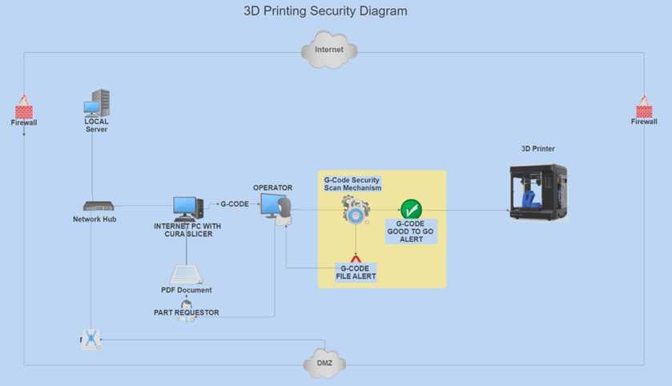

# File Handling and Processing #

•	Files are received as PDF documents containing the part.
A Cura slicer on the computer will slice the part and convert it to G-CODE for printing.
The file is then opened in the frontend app and sent for printing.
The frontend app sends it directly to the backend app and it is scanned for integrity.
The backend app will alert the user with a status of pass or fail alert.
The user will take action based on the result of the scan.

•	3D Printer Interfacing
•	User Interface

**REVISITING THE 3D-PRINTING BLOCK DIAGRAM**

DIAGRAM B

DiagramB: This diagram gives a high-level view of the application components in a typical network environment. There are no portable usb drives used in this scenario since it could be a military or Government environment.

