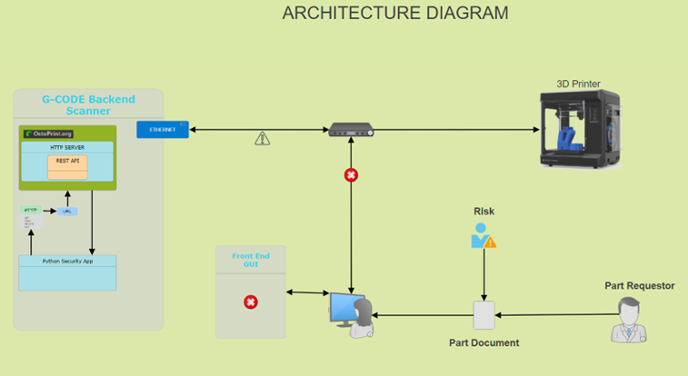

# System Architecture / Logical Structure #

Diagram A

**Component Description**

•	Backend G-Code Parser Pre-Print Scanner

•	Frontend User Interface

•	All devices are networking

•	Diagram A shows a risk introduction

•	The exclamation mark is a response action from the backend scanning application

•	The red X shows that a file was damaged or compromised

•	Inside the scanner diagram we can see the backend application communicating with OctoPrint

**Diagram A:**
Depicts the risk introduced to a file and how the backend application picks up the mistake
and rejects the G-Code alerting the user to stop printing and supply a new or correct document.

**Component Overview**

•	The diagram shows a logical process of client and hardware interaction as well as a third-party risk shown to demonstrate how the application will block the print to avoid downtime or damage.

•	Please see the high-level view of the components in the diagram above.
We can see
that there are two major software components which make up the G-Code Pre-Print Scanning design. The frontend and the backend apps are
running seamlessly on the network without any use of external USB drives.

•	Data flow on the network shows that the print job is sent via the frontend app to the printer and the app will direct the file to the backend app for a complete security scan. Once the data has been approved and safe an alert will be sent to the client giving them the opportunity to print or stop.

**Interface and APIs in Diagram A**
The interface inside the left surrounded diagram labeled "G-Code Backend Scanner" shows HTTP Web services running on some hardware. The important component of that diagram is the G-Code scanner service running on the shown hardware. Note: This hardware can be a personal choice of Windows, OS X, Rasberry Pi etc.

**OctoPrint API Integration:**

As we delve into the low-level view of the OctoPrint, we will examine the features provided by the REST API services.
REST API General information is obtained by visiting their website. There is a wealth of information available as well as plugins to handle API keys so that clients can implement their own solution.

https://docs.octoprint.org/en/master/api/general.html

This document will not go into details of any code unless deemed necessary for some unclear workflows.
